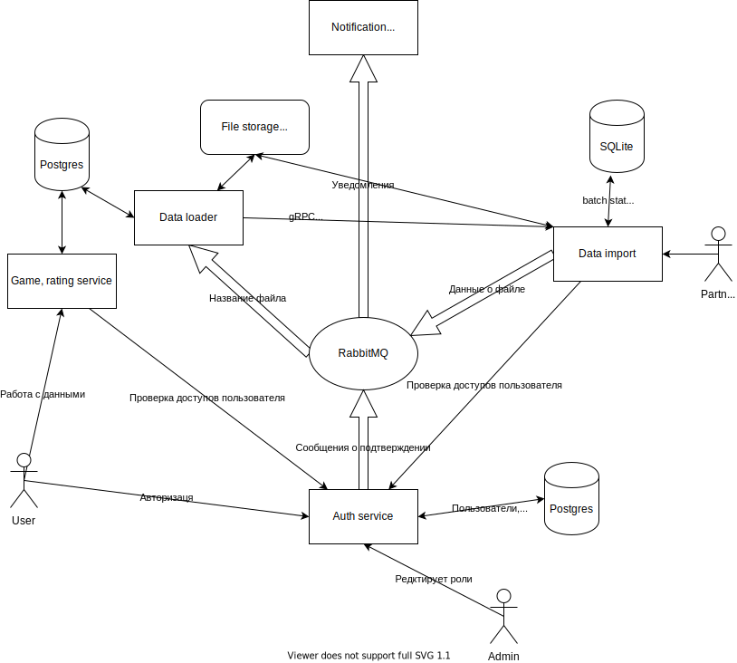

# Хранилище коллекций игр
Является учебный проектом, изначально был проект https://github.com/asanikushin/shop-systems, но потом поменял тему. 

Является упрощенным клоном части фукнционала сайта [BGG](https://boardgamegeek.com/). Копируется две части: коллекции и лог (журнал) игр.

## Функционал
Пользователи могут создавать и редактировать свои коллекции игр, добавляя игры из общего списка по их `id`.
Кроме того пользователи могут выставлять играм оценки, при повторном выставлении оценки старая удаляется.

Дополнительно пользователи могут вести журнал своих игр - с кем и когда играли. Если указать других игроков, то им будет приходить уведомление при измении данных игры

## Сервисы
Графическая [структура](https://app.diagrams.net/?lightbox=1&highlight=0000ff&edit=_blank&layers=1&nav=1&title=Untitled%20Diagram.drawio#R7VxLd5s4GP0ts%2FA500VyeBgMSzuvtidt02baaVc9Msi2poAYISdxf%2F1IIIEQmDo2dpxpssDwSQgj3fs9FQ%2Fss%2FjhioB08Q6HMBpYRvgwsM8HlmUZrss%2BuGRVSEzTHhWSOUGhkFWCW%2FQTCqEhpEsUwqzWkWIcUZTWhQFOEhjQmgwQgu%2Fr3WY4qj81BXPYENwGIGpK%2F0YhXRRSzxpV8tcQzRfyyabrFy0xkJ3Fm2QLEOJ7RWRfDOwzgjEtzuKHMxjx2ZPzUtx3uaa1%2FGIEJnSTG8iX1dcHl84%2FpGCZZOOr4W18fWKLYe5AtBRvPDg3Br7BjxN2bg68XDK5yM8LuZcfR%2FnRyOVufrwUb0pXcvpgyGZTXCY4YR8TgpdJCPmXMtgVJnSB5zgB0TXGKROaTPgPpHQlsACWFDPRgsaRaIUPiH7lt5864upb7er8QYydX6yUixtIUAwpJFKWULL6ql4oI%2FHLaqj8So6VUUDomKOreq1cdomiSPRpLo%2BY6gwvSQA71kTCHJA5pB39BLX4FCsPEIt%2FBTF7U7JiHQiMAEV3dUADwYt52a%2BCDjsR6HkMkqxWJI0NiRJ2NBUkWUJuFQAy8xMmGSr9z%2BWRdZjk52cCf88VZxW0vsmnHD3OvKPCWVNhfc7YROuAYNo25afLOBoHFLOVmNxBQhHT7NdgCqMbnCGKcMK6TDGlOGYdIt4wAcGPeY6dMxzx%2B9ho9iz%2FU8YYR2jO76UcSypo8JJGKIFnpTnqXCM%2BHHzonFXZahd3CDvqDIVVua%2BMki1EC8UeucaelkEawHa6OwqVxwrdPWlE2NGWPfNWoQYMqSHYcfJbcX17HlvP0l40zcU4jFHyvyeyM6wz2fWfmMmm08mwikwXlfQoCWcOHuXEBUtyl7%2BBuRP77A3ZNzoq9tkN9t0wtyL5DQzpyDNq%2FLOenH9%2BuyW1ZQim2dMLxRGeKK3nioXtDsTaKS0XGhT%2BZp0f%2B%2BJ7J9u3J%2BWwb7KJW28wYl%2BlxNLQqOty09BAUmgFcZeGk%2FJr7GBD22Mu%2F1yJoUYKjIw6UHLoCMdLDbt8BVtGJ5J6d78eYwu2Dao0nO%2BMMlX1f%2FQ%2Fv5%2BMvnz4%2Fvk2zC6Xnyd%2FZZcyZDkS1T9sYsZyI%2Fb9JzOcg7taa%2FffJZYNJ1m%2BeGPWwfTSh6qRnc355ycwnSL67qMcjX25YsCiuYmjKEJpxuFzv0AU3qYgn%2Bx7AjRL0IPStzWny25R%2BqbVovW9vcVP%2FkGJZW5FrB2yYkEEsgwFWsJiN1fL3dDVkrnjIyGc9CZ0LX1Zj3WZEj5TNPZFXW%2BXIbRTj43PJN2mpGRakU%2BromtTkXgdQXXuz9XxA4R7FrDFgqrvJ%2F22GIVhERFApiDANB%2BPoyHlRi%2BfSmcycM5bF76TGQ12l0l%2B8ZSBmkdvY71xatqGVyO%2BdHy3NfyyC57NMrgXm%2B7urp6Hbep5vGSKjt0NyR1iLNtQSdcV0OEVteNtqKj35563J7r87jy1I9PZF79ysLaJvvfkmm%2FnfPm2XbcT1q8MRX6lh%2FH9uWWjDc3EpkFCqU0c33Vq6PScY9cmdou3J2yPlm21FINhyMRtWaFRo8%2FSolhKHveyNpS4ZUcL9wQVRUuNTs1OCuy3OLMpiI8rqduiK3sxXueAAv7sOGWre6y2y9VqNG2ZpcPaLruZ5nthfwf7R8fCfu9Zst%2FbE%2FuvQAzzSMcg7C2S%2BfG7sWY9x2xbT60JmjnmG5zROQvaGnMlHbFgFSE2aeTXEzYtZvd6WgrK1P%2BHIovf38wO6zNrjpoz6x4yj2M2g%2FtnOrOulsx2nKee2pa9aYLvWQqSjfSJ2aZPbj9es1lXdEcx3BrdceSr5mgliKdeNau5alNAgzz3QAFdNmkBk3BN1rApVs32mvx%2FFW%2BuiT5Lc297tmrvTw3b6w56W6rP29t4Ce%2FeKsfKijstKy5lO9a8XFdTEyMNScWLN2pejYFG%2BpYmSxto38WztkJIT9Dcoth5%2BH1DmzqZ%2FlHhb%2BjUPYCt8ecY2kCHxl9Lppet6NhUwqMLuW2WBUP%2B%2Blq%2FmmrUAq%2BhElo1gzxXie20kTfdeqfn7Z5kp8C25FlbzVhggn4yXwIcrmr1yHTkiXFqjtwdE5Br9jEMN6TCnjKZb%2B13i%2FjEWdhvLT96M5pOU%2BeqZd%2Fv%2FNNNS%2FUrYzqb9YswCEWo%2BAivYz%2BV0z40eNfGgt48iApaji%2BtoUxmNbzKPer4sjwvVbO%2Br2ZTHT%2FUwsXSeBwRsK0GsC8RAykHKyb8v5MaEP8zZjqWQg7zOxwtY%2Fiqge5KC5sHSXiwNatNdFsYsreMR%2Bu0tqQ%2B9xx49OKpbcrzLigdiaf25Czui6EHCBSOOExoqUQ9A%2FCZ%2Bo4ve0vwWVq8YekD9Qe%2BLu4r4BPFMO7htOzXPniqW5%2BfQ2r%2B1hlrGtS90nXznRJePU916m%2B1UaJXM%2FIMAn5tv%2F7WRNb3%2Fet5g%2F54%2FN74Cs00ni%2B%2BOekNfvPme3KdtPBYOnZsZM7nYAFIJtZFZqyXdMbTNHoC%2B5dp8KD4jwueAifz6Z9GUT2TH6%2FyIYw8Vz4DMYpWRdfXMLqDPB5W2rXanNJQPJS3JJjEPFAu2%2B4AQYB9sqiaxV68FNLdLwDpui73AlC8cWgU%2BDciSBkfTtjrBzzGa9yJSboAiRjSKmRMndETsZ2Ri8sdjbKNJ%2FcT8SRDvmreQgkbbMbGl0%2FKEx8FAfIfGFAec49JWP9i5VjsXaY%2FEBuOj5lRgn%2FAE0GhWr%2BqWnCiraM1LHZ8GtbQFyeOXM181BAGmNdIcaKuD0oQRXJu9H7KI2r9Zsy%2BUP2FQ5SlEVjJ7nkpwzL%2BKPZlgERgU0Pre0zRjKEq%2Fy%2BhdUWXKsZ5gfMLnHuH84sGfYHc89Wgzd0unRXrLUKAls32DQ9z403bLb9N0FcEwC6rX8wpXLPqh4fsi%2F8A)



Функционал разбит на три сервиса - сервис авторизации для работы с пользователями, основной сервис работы с данными и сервис импорта данных. Во всех случаях, где требуется авторизация, пользователь указывает свой access token в хедер авторизации как `Bearer Token`

При работе со встроенными Docker образами и `docker-compose` первый будет расположен на `localhost:8082`, второй на `localhost:8081`, третий на `localhost:8083`

### Пользователи
После регистрации пользователю приходит ссылка для подтверждения регистрации, после этого появляется возможность входа в систему - получене двух токенов. 
По умолчанию все пользователи могут выполнять любые запросы на чтение (например список игр или рейтинг игры), а также выставлять свои оценки существующим играм. 

Методы API:
* /register
* /signin
* /refresh
* /validate
* /change_role

Первые 3 метода выполняются пользователем для работы. Последний метод используется админимстратором для смены ролей пользователей (например сделать админом друго пользователя)

### Коллекции игр
В данный момент есть только одна коллекция игр. Читать ее данные может любой пользователь (в том числе и без авторизации), добавлять или редактировать может только администратор.

Методы API:
* /games:
    * POST - добавление игры
    * GET -  получение всего списка игр (возможно указание количества и отступа)
* /games/<game_id>:
    * GET - получение информации об одной игре, в том числе рейтинга
    * PUT - редактирова игры
    * DELETE - удаление игры
При удалении игры вместе с ней удаляется данные про его рейтинг
    
### Рейтинг
Каждый пользователь может проголосовать зя любую созданную игру. Если игра будет удалена, то все голоса пользователей будут удалены

Методы API:
* /rating:
    * POST - добавить оценку определенной игре. Оценка и `id` игры указывается в теле запроса
    * PUT - добавить оценку определенной игре. Оценка и `id` игры указывается в теле запроса
* /rating/<game_id>:
    * GET - узнать рейтинг определенной игры. Считается как среднее по всем существующим оценкам
    * DELETE - удалить свою оценку для игры
    * PUT - позволяет изменить свою оценку
* /rating/user - получение всех своих оценок, для определения пользователя используются access token
* /rating/user/<user_id> - получение всех оценок конкретного пользователя

### Импорт данных
Есть отдельный серсив для импорта данных, он расположение на `localhost:8083`

Методы API:
* /game:
    * POST - импортировать данные из `csv` или `xml` файла. Возможно указание нескольких файлов в одном запросе в разных аргументах
    * GET - получить информацию по загрузке. Требуется указать ключ `file_id`, которые вернули на `POST` запрос.

## Данные
Все запросы и ответы содержат данные в формате `json`.

Описание игры:
* name - обязательное поле, содержащее уникальное название игры
* category - обязательное поле, содержащее категорию игры
* min_players - необязательное поле описывает минимальное число игроков. Должено быть больше 0
* max_players - необязательное поле описывает максимальное число игроков

Если заданы min_players и max_players, то `min_players <= max_players` 

Описание оценки/голоса:
* score - обязательное поле описывает оценку - дробное число от 0 до 10 включительно
* game_id - обязательное поле, содержащее `id` игры

Описание пользователя:
* email - обязательное поле, содержащее почту пользователя, куда приходят уведомления
* password - обязательное поле, содержащее пароль для аккаунта

## Установка и запуск
### Установка
Необходимо скачать репозиторий и подтянуть необходимые подмодули:
```shell script
git clone --recursive https://github.com/asanikushin/game-collection.git
```
Если уже склонировали репозиторий, то:
```shell script
git submodule init
git submodule update
```

### Запуск
В проекте есть `docker-compose` файл для простого тестового запуска. Для локального запуска досточно выполнить:
```shell script
docker-compose up
```
Он сам скачает и соберет нужные образы. Если требуется запустить после изменения кода (например обновление репозитория), то надо указать флаг `--build` в последней команде

### Тесты
В проекте есть тесты на часть функционала. Чтобы запустить их локально требуется установленный `pytest` в питоновском окружении, сам запуск можно осуществить одной командой:
```shell script
pytest
```